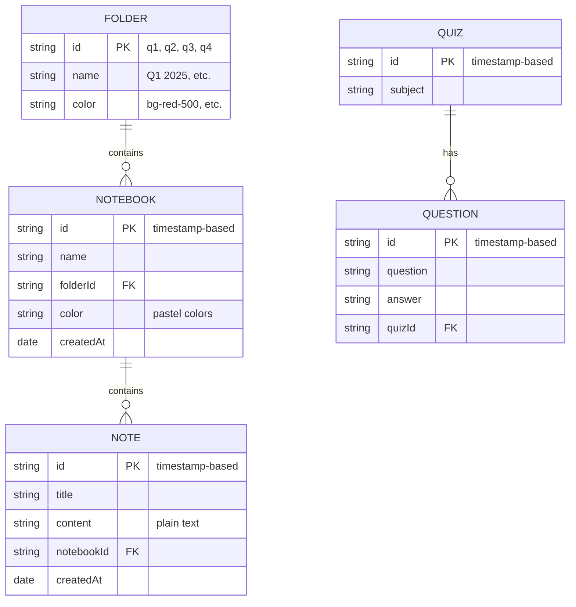
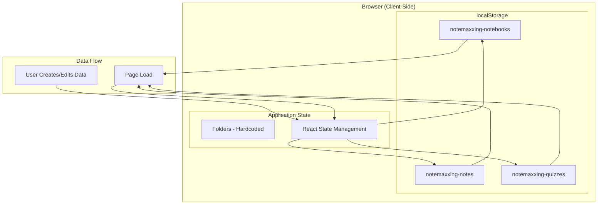
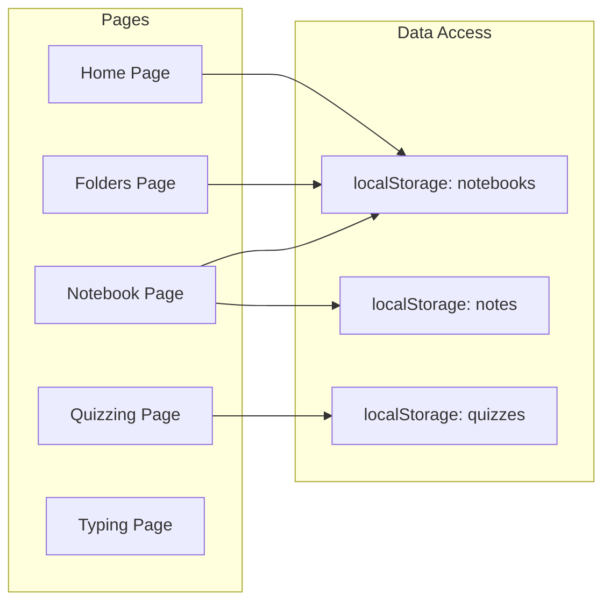

# Notemaxxing Data Architecture

## Overview
Notemaxxing currently uses browser's localStorage for data persistence. This is a client-side storage solution that keeps all data on the user's device.

## Data Models

### 1. Folders
- **Storage Key**: `notemaxxing-folders`
- **Structure**: 
  ```typescript
  {
    id: string;         // Timestamp-based ID
    name: string;       // User-defined name
    color: string;      // Tailwind CSS class (bg-red-500, etc.)
    createdAt: Date;    // Creation timestamp
  }
  ```
- **Notes**: Initialized with Q1-Q4 on first load, fully customizable

### 2. Notebooks
- **Storage Key**: `notemaxxing-notebooks`
- **Structure**:
  ```typescript
  {
    id: string;         // Timestamp-based ID
    name: string;       // User-defined name
    folderId: string;   // References folder ID
    color: string;      // Random pastel color
    createdAt: Date;    // Creation timestamp
    archived?: boolean; // Archive status
    archivedAt?: Date;  // Archive timestamp
  }
  ```

### 3. Notes
- **Storage Key**: `notemaxxing-notes`
- **Structure**:
  ```typescript
  {
    id: string;         // Timestamp-based ID
    title: string;      // Note title
    content: string;    // Note content (plain text)
    notebookId: string; // References notebook ID
    createdAt: Date;    // Creation timestamp
  }
  ```

### 4. Quizzes
- **Storage Key**: `notemaxxing-quizzes`
- **Structure**:
  ```typescript
  {
    id: string;         // Timestamp-based ID
    subject: string;    // Quiz subject/name
    questions: Question[];
  }
  
  interface Question {
    id: string;         // Timestamp-based ID
    question: string;   // Question text
    answer: string;     // Answer text
  }
  ```

## Data Hierarchy
```
Folders (Q1-Q4)
  └── Notebooks
        └── Notes
```

## Current Limitations
1. **No server-side storage** - Data is only stored in the browser
2. **No sync across devices** - Each device has its own data
3. **No backup** - Clearing browser data will delete all notes
4. **No collaboration** - Single user only
5. **Storage limits** - localStorage typically has a 5-10MB limit

## Data Architecture Diagram



## Storage Architecture Diagram



## Component-Data Relationship



## Future Considerations
To scale the application, consider:
1. **Database integration** (PostgreSQL, MongoDB)
2. **User authentication** 
3. **Cloud sync** (Supabase, Firebase, or custom backend)
4. **Export/Import functionality**
5. **Rich text editing** (currently plain text only)