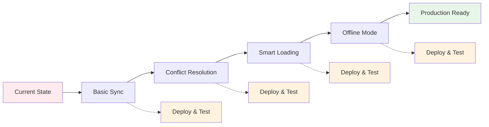

# Implementation Roadmap

## Strategy: Technical Foundation First

Build robust real-time sync infrastructure before adding social complexity. This provides immediate value to existing users while laying groundwork for future collaboration features.

## Phase 1: Real-Time Sync (Current Priority)

### Why Real-Time First?

- **Immediate value** for existing users (better single-player experience)
- **Technical foundation** for all future features
- **Lower risk** implementation (no user model changes)
- **Easier testing** (can validate with single account)
- **Clean architecture** before adding social complexity

### Implementation Plan (7-9 days)

#### Week 1: Core Infrastructure

**Days 1-2: Basic Real-Time**

- Set up Supabase Realtime channels
- Subscribe to user's own data changes
- Handle INSERT, UPDATE, DELETE events
- Update local store on remote changes

**Days 3-4: Conflict Resolution**

- Add version columns to tables
- Implement optimistic updates with rollback
- Last-write-wins strategy with version checking
- Conflict detection and user notification

**Day 5: Smart Subscriptions**

- Subscribe only to active folders/notebooks
- Unsubscribe on navigation
- Implement connection management
- Add reconnection logic

#### Week 2: Polish & Reliability

**Days 6-7: Offline Support**

- Queue operations when offline
- Sync queue on reconnection
- Handle conflicts with server state
- Persist queue to localStorage

**Days 8-9: Testing & UI**

- Connection status indicators
- Sync progress feedback
- Error handling and recovery
- Performance optimization

### Incremental Delivery Approach



### Deployment Strategy

**1. Feature Flag Approach**

```typescript
// Enable incrementally
const FEATURES = {
  REALTIME_SYNC: process.env.NEXT_PUBLIC_REALTIME === 'true',
  CONFLICT_RESOLUTION: false,
  OFFLINE_SUPPORT: false,
}
```

**2. Progressive Rollout**

- Day 1-2: Internal testing (you only)
- Day 3-4: Beta users (opt-in)
- Day 5-7: 50% rollout
- Day 8+: Full deployment

**3. Monitoring & Rollback**

- Track sync latency (<200ms target)
- Monitor conflict rate (<1% target)
- Watch connection stability
- One-click rollback ready

## Phase 2: Social Features (Future)

_Archived for later implementation - see [SOCIAL_FEATURES_ROADMAP.md](./SOCIAL_FEATURES_ROADMAP.md)_

Once real-time sync is stable and proven, we'll revisit social features with a solid technical foundation in place.

## Current Sprint Focus

### Sprint 1: Basic Real-Time (Days 1-2)

```typescript
// Implement in lib/store/realtime-manager.ts
class RealtimeManager {
  private channel: RealtimeChannel | null = null

  async initialize(userId: string) {
    this.channel = supabase
      .channel(`user-${userId}`)
      .on(
        'postgres_changes',
        {
          event: '*',
          schema: 'public',
        },
        this.handleChange
      )
      .subscribe()
  }

  handleChange(payload: any) {
    // Update store based on change type
    // Skip if change originated from this client
  }
}
```

### Sprint 2: Version Control (Days 3-4)

```sql
-- Add to migration
ALTER TABLE notes ADD COLUMN version INTEGER DEFAULT 1;
ALTER TABLE notes ADD COLUMN last_modified_by UUID;

-- Increment version on update
CREATE OR REPLACE FUNCTION increment_version()
RETURNS TRIGGER AS $$
BEGIN
  NEW.version = OLD.version + 1;
  RETURN NEW;
END;
$$ LANGUAGE plpgsql;
```

### Sprint 3: Smart Subscriptions (Day 5)

```typescript
// Subscribe to specific resources
subscribeToNotebook(notebookId: string) {
  const channel = supabase
    .channel(`notebook-${notebookId}`)
    .on('postgres_changes', {
      event: '*',
      schema: 'public',
      table: 'notes',
      filter: `notebook_id=eq.${notebookId}`
    }, this.handleNoteChange)
    .subscribe()

  this.activeChannels.set(notebookId, channel)
}

// Clean up on navigation
unsubscribeFromNotebook(notebookId: string) {
  const channel = this.activeChannels.get(notebookId)
  if (channel) {
    supabase.removeChannel(channel)
    this.activeChannels.delete(notebookId)
  }
}
```

### Sprint 4: Offline Queue (Days 6-7)

```typescript
// Offline operation queue
interface QueuedOperation {
  id: string
  type: 'create' | 'update' | 'delete'
  entity: 'folder' | 'notebook' | 'note'
  data: any
  timestamp: number
}

class OfflineQueue {
  private queue: QueuedOperation[] = []

  add(operation: QueuedOperation) {
    this.queue.push(operation)
    this.persist()
  }

  async flush() {
    for (const op of this.queue) {
      await this.processOperation(op)
    }
    this.queue = []
    this.persist()
  }
}
```

## Success Criteria

### Phase 1 Complete When:

- [ ] Real-time sync works reliably
- [ ] Conflicts are handled gracefully
- [ ] Offline mode queues changes
- [ ] Performance remains fast (<200ms sync)
- [ ] No data loss scenarios
- [ ] UI shows sync status clearly

### Metrics to Track

- **Sync latency**: p50 < 100ms, p99 < 500ms
- **Conflict rate**: < 1% of updates
- **Offline recovery**: 100% success rate
- **User satisfaction**: No complaints about sync

## Next Steps

1. **Today**: Review REALTIME_SYNC_PLAN.md
2. **Tomorrow**: Start Sprint 1 (Basic Real-Time)
3. **Day 3**: Deploy to preview branch for testing
4. **Day 5**: Evaluate progress, adjust plan
5. **Week 2**: Complete remaining sprints
6. **Day 10**: Production deployment

## Risk Mitigation

| Risk                     | Mitigation                               |
| ------------------------ | ---------------------------------------- |
| Supabase Realtime limits | Implement smart subscriptions early      |
| Complex conflicts        | Start with last-write-wins, evolve later |
| Performance degradation  | Feature flags for instant rollback       |
| Data corruption          | Comprehensive testing, version tracking  |

## Development Tips

1. **Test with multiple tabs** open to same notebook
2. **Simulate conflicts** with rapid edits
3. **Test offline** using browser dev tools
4. **Monitor Supabase dashboard** for connection count
5. **Use preview deployments** for each sprint

---

_Social features roadmap archived in [SOCIAL_FEATURES_ROADMAP.md](./SOCIAL_FEATURES_ROADMAP.md) for future implementation_
