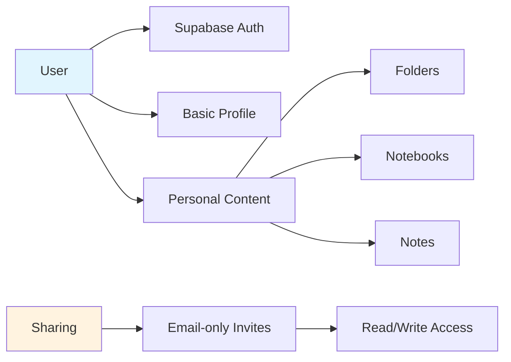
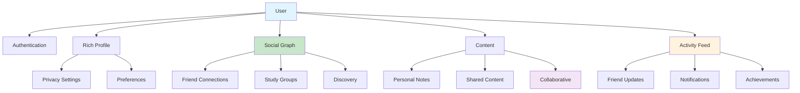

# Social Features Roadmap

## Executive Summary

Transform Notemaxxing from a single-player note-taking app into a collaborative learning platform with social features that enable users to connect, share, and learn together.

## Current State

Notemaxxing currently operates as an isolated productivity tool where users:

- Create and organize personal notes in folders/notebooks
- Share individual items via email invitations
- Have no awareness of other users on the platform
- Cannot discover or connect with friends
- Miss opportunities for collaborative learning

### User Model Today



## Vision: Social Learning Platform

Transform into a platform where users can:

- **Connect** with friends and discover study partners
- **Collaborate** on shared notebooks and notes
- **Compete** through quizzes and typing challenges
- **Celebrate** learning milestones and achievements

### Future User Model



## Implementation Roadmap

### Phase 1: Foundation (Week 1-2)

**Goal**: Enable basic user connections

- **Friend System**: Add/accept/decline friend requests
- **User Discovery**: Search by username/email
- **Profile Enhancement**: Public profiles with visibility controls
- **Basic Notifications**: Friend requests and acceptances

### Phase 2: Sharing 2.0 (Week 3-4)

**Goal**: Streamline content sharing between friends

- **Quick Share**: One-click sharing with friends
- **Bulk Sharing**: Share entire folders with friend groups
- **Share Templates**: Common permission presets
- **Activity Indicators**: See when friends view/edit shared content

### Phase 3: Collaboration (Week 5-6)

**Goal**: Enable real-time collaboration

- **Real-time Sync**: Live updates on shared notes
- **Presence Indicators**: See who's viewing/editing
- **Comments**: Inline comments and discussions
- **Version History**: Track changes by collaborator

### Phase 4: Social Features (Week 7-8)

**Goal**: Build community engagement

- **Activity Feed**: See friends' public activities
- **Study Groups**: Create/join topic-based groups
- **Achievements**: Badges for milestones
- **Leaderboards**: Typing speed, quiz scores, streaks

### Phase 5: Discovery & Growth (Week 9-10)

**Goal**: Help users find valuable connections

- **Friend Suggestions**: Based on mutual connections
- **Interest Matching**: Connect users studying similar topics
- **Public Notebooks**: Discover and follow public content
- **Invite System**: Referral rewards and onboarding

## Success Metrics

### User Engagement

- **DAU/MAU ratio** increases from 20% to 40%
- **Session duration** increases by 50%
- **Content creation** up 30% via collaboration

### Social Metrics

- **Average connections** per user: 5-10 friends
- **Sharing rate**: 30% of users share content monthly
- **Collaboration rate**: 15% use real-time features

### Growth Metrics

- **Viral coefficient**: 0.5+ (each user brings 0.5 new users)
- **Retention**: 60% monthly retention (up from 40%)
- **NPS**: 50+ (promoters driving organic growth)

## Technical Considerations

### Architecture Changes

- **WebSocket infrastructure** for real-time features
- **Notification service** for email/push notifications
- **Search infrastructure** for user/content discovery
- **Caching layer** for social graph queries

### Privacy & Security

- **Granular permissions** for content sharing
- **Block/report system** for user safety
- **Data encryption** for sensitive content
- **GDPR compliance** for social features

### Performance

- **Lazy loading** for social graphs
- **Pagination** for activity feeds
- **Caching** for frequently accessed profiles
- **CDN** for user-generated content

## Implementation Priority

1. **Friend connections** - Core social infrastructure
2. **Enhanced profiles** - User identity and discovery
3. **Notifications** - Engagement driver
4. **Activity feed** - Social proof and retention
5. **Real-time collaboration** - Differentiator feature

## Risks & Mitigations

| Risk                    | Impact | Mitigation                                 |
| ----------------------- | ------ | ------------------------------------------ |
| Privacy concerns        | High   | Granular privacy controls, opt-in features |
| Spam/abuse              | Medium | Moderation tools, rate limiting            |
| Performance degradation | Medium | Progressive rollout, monitoring            |
| Feature complexity      | Low    | Phased approach, user testing              |

## Next Steps

1. **User Research**: Survey existing users about social features
2. **Technical Spike**: Prototype friend system
3. **Design Mockups**: UI/UX for social features
4. **Infrastructure Planning**: WebSocket and notification services
5. **Privacy Review**: Legal/compliance requirements

---

## Appendix: Database Schema Changes

### Core Tables for Social Features

**User Connections** - Friend relationships and requests

```sql
CREATE TABLE user_connections (
  id UUID PRIMARY KEY,
  user_id UUID REFERENCES auth.users(id),
  friend_id UUID REFERENCES auth.users(id),
  status TEXT CHECK (status IN ('pending', 'accepted', 'blocked')),
  initiated_by UUID REFERENCES auth.users(id),
  created_at TIMESTAMP,
  accepted_at TIMESTAMP,
  UNIQUE(user_id, friend_id)
);
```

**Notifications** - User notifications and alerts

```sql
CREATE TABLE notifications (
  id UUID PRIMARY KEY,
  user_id UUID REFERENCES auth.users(id),
  type TEXT,
  data JSONB,
  read BOOLEAN DEFAULT false,
  created_at TIMESTAMP
);
```

**Activity Feed** - User activities for social feed

```sql
CREATE TABLE user_activities (
  id UUID PRIMARY KEY,
  user_id UUID REFERENCES auth.users(id),
  activity_type TEXT,
  resource_type TEXT,
  resource_id UUID,
  metadata JSONB,
  visibility TEXT DEFAULT 'friends',
  created_at TIMESTAMP
);
```

**Study Groups** - Group collaboration spaces

```sql
CREATE TABLE study_groups (
  id UUID PRIMARY KEY,
  name TEXT,
  description TEXT,
  owner_id UUID REFERENCES auth.users(id),
  settings JSONB,
  created_at TIMESTAMP
);

CREATE TABLE group_members (
  group_id UUID REFERENCES study_groups(id),
  user_id UUID REFERENCES auth.users(id),
  role TEXT DEFAULT 'member',
  joined_at TIMESTAMP,
  PRIMARY KEY (group_id, user_id)
);
```

**Profile Enhancements**

```sql
ALTER TABLE profiles ADD COLUMN
  visibility TEXT DEFAULT 'friends' CHECK (visibility IN ('public', 'friends', 'private')),
  allow_friend_requests BOOLEAN DEFAULT true,
  interests TEXT[],
  notification_preferences JSONB DEFAULT '{"email": true, "in_app": true}',
  social_links JSONB;
```
